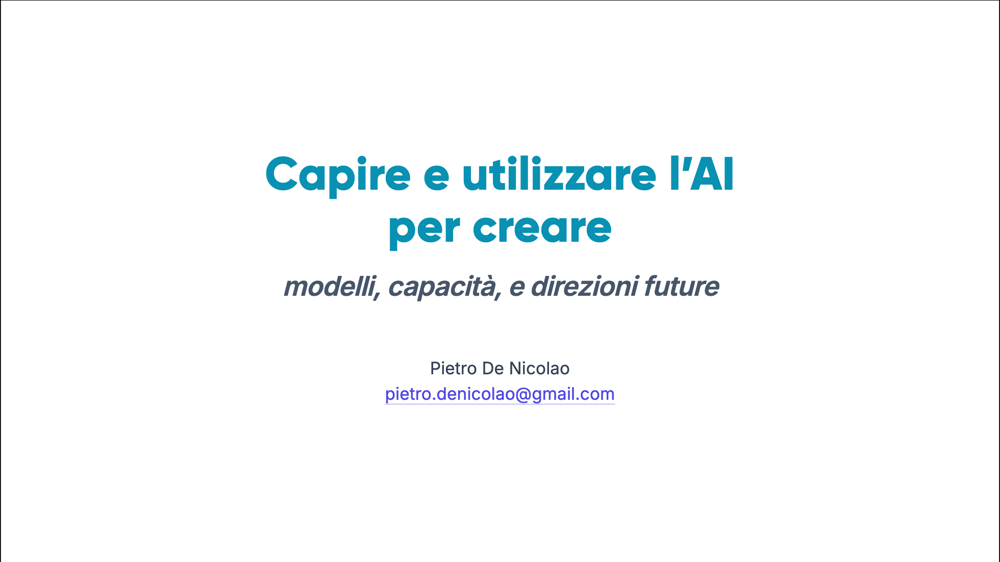

{}
[**Apri il deck interattivo →**](/slides/ai-intro-presentation-202604/)
{}

Ho preparato una presentazione introduttiva e divulgativa su **AI e GenAI**. L'obiettivo è dare gli strumenti per capire *cosa* sono gli LLM e i modelli generativi, *come* si differenziano dal machine learning classico e dal software tradizionale, e *dove* ha senso usarli.

## Come è fatta

Le slide sono costruite con [Slidev](https://sli.dev/), un framework per slide basato su Markdown e Vue. Il deck è un'applicazione web statica ed è completamente offline una volta caricato.

Il sorgente, comprese le note del presentatore, è disponibile su GitHub: [pietrodn/ai-intro-presentation-202604](https://github.com/pietrodn/ai-intro-presentation-202604).
