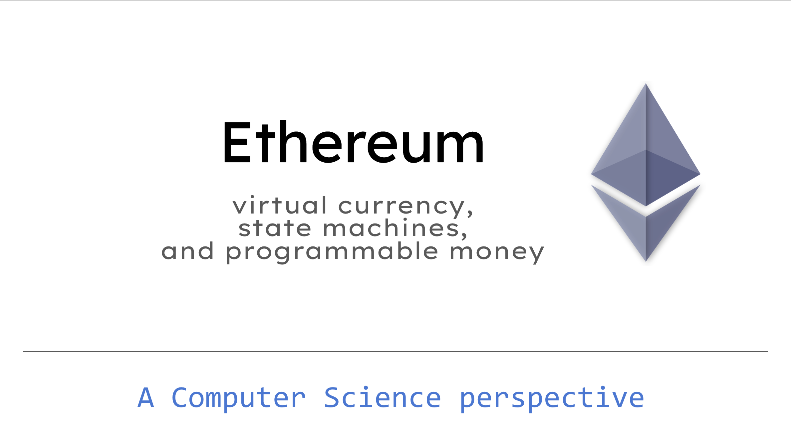

On June 6th, 2022, I held a seminar at [Università degli Studi di Milano](https://www.di.unimi.it/ecm/home/aggiornamenti-e-archivi/tutte-le-notizie/content/ethereum-virtual-currency-state-machines-and-programmable-money.0000.UNIMIDIRE-98602) about **Ethereum: virtual currency, state machines, and programmable money**.

The presentation is about Ethereum from the point of view of a computer scientist. It discusses Ethereum's global state, the consensus mechanism, smart contracts, ERC20, and more.

The slides are publicly available ([Google Sheets](https://docs.google.com/presentation/d/1M1UDURc5cw4R7FG3S0lk14v7H1fzbsP6sOO6LL98UfQ/edit?usp=sharing); [PDF](EthereumSlides-2022-05-26.pdf)).
