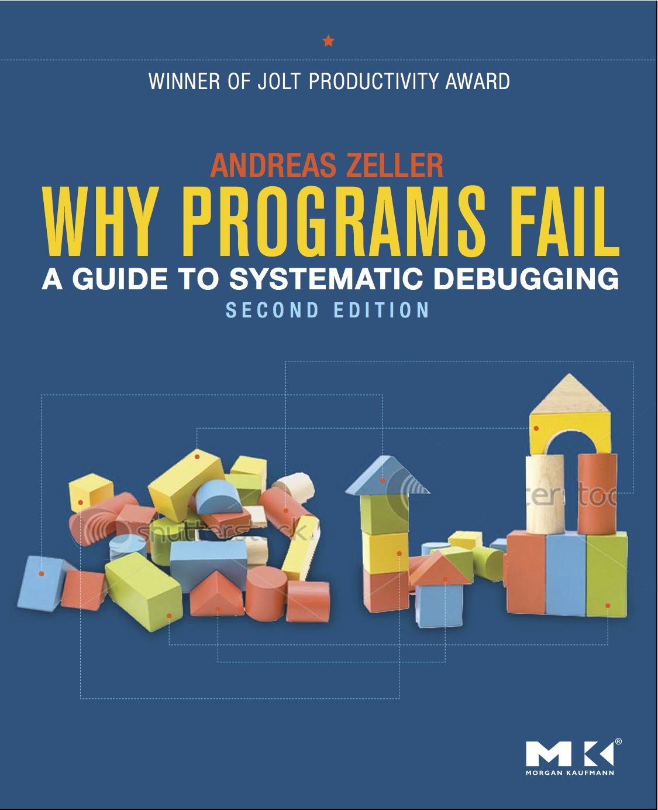

{}
[*Why Programs Fail: A Guide to Systematic Debugging*](https://www.whyprogramsfail.com/) ([Andreas Zeller](https://andreas-zeller.info/))
{}

🪲 How do you debug a software issue? For me, it has always been a combination of staring at the program code very intensely, collecting evidence from past runs, intuition, and a lot of trial and error: keep changing things until the problem disappears.

🔬 Can we evolve past these "random", unguided approaches, and debug a program using *the [scientific method](https://en.wikipedia.org/wiki/Scientific_method)*? After all we're software *engineers*, and the distinctive quality of engineers is the use of scientific principles to design and build systems.

## 📦 Contents

The book first presents a sound theoretical and practical framework to identify, report, and reproduce **failures**. It then explains how to systematically isolate the "infection" from a failure report by elaborating hypotheses and building *controlled* experiments (not random trial & error!) to prove or disprove them. Finally, it shows how to pinpoint and correct the **software defect** that is causing the issue.

The book introduces a simple and practical search algorithm to pinpoint the cause of failures based on binary search ([*delta debugging*](https://en.wikipedia.org/wiki/Delta_debugging)), showing a practical application where it tracks down a bug in a complex software project such as GCC. It shows some innovative research applications of static and dynamic analysis techniques that aren't yet available in commercial IDEs.

The most valuable teaching from the book---for me---has been Chapter 6, which explains:

1. That there are 4 ways to reason about a program: deduction, observation, induction, and experimentation.
2. How to elaborate hypotheses about the cause of a failure: every hypothesis must include all the earlier confirmed hypotheses, and exclude all the earlier disproved hypotheses.
3. How to build a controlled experiment to prove or disprove the hypothesis. This is the only way to prove *causality* by its very definition, which is counterfactual (A causes B if, without A, B does not happen).

This is the scientific method, applied to software engineering. The author claims that "among all scientific disciplines debugging is the one that can best claim to deal with actual causality". I couldn't agree more.

The book wraps up with a chapter about how to fix bugs:
- one at a time
- with regression tests
- adding assertions where needed
- checking every fix to retrospectively validate causality

The last chapter ("Learning from Mistakes") explains how to set up software engineering processes to prevent and catch bugs early (ideally, at the specification phase), and how to identify the "riskiest" software modules. Very relevant for tech leads and engineering managers.

## 💯 My impression

I found the book rigorous and insightful. It is a much-needed wake-up call for software engineers to work more scientifically, and to avoid considering debugging an "art" or an exoteric discipline.

It's shocking how little of the research state-of-the-art is shipped in the commercially available software development tools. The most advanced debugging tool most people (including me) have ever used in their profession is the "classic" debugger with the same features from 15 years ago. There's so much more we could do! (In particular, I'd love to use an omniscient debugger...)

I found only two minor shortcomings:

- The book is very "academic": it presents the state of the art of the "systematic debugging" research area, and does not investigate the industry best practices. From my (limited) experience, however, the commercially available debugging tools are well behind what has proven possible by the research.
- Most of the debugging techniques that are listed assume that one is always able to reproduce a failure deterministically, and that doing so is inexpensive. In my experience with cloud-based and distributed systems, this is not always true: we often deal with intermittent failures that are hard to even reproduce. In these cases, one is limited to applying the advice about assertions and static analysis, as dynamic analysis becomes impossible.

Overall, the book is full of practical and actionable advice, and I found it a great read. I'd recommend it to all software developers with a computer science background.

